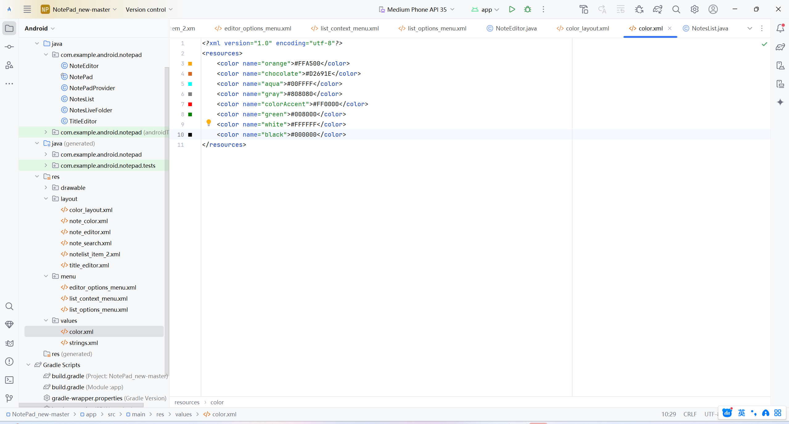

## 配置详情

### 1.添加时间戳
先在notepad添加时间戳
/**
         * 创建时间戳的列名
         * 
类型：INTEGER （来自System.curentTimeMillis()的长整型）

         */
        public static final String COLUMN_NAME_CREATE_DATE = "created";

        /**
         * 修改时间戳的列名
         * 
类型：INTEGER （来自System.curentTimeMillis()的长整型）

         */
        public static final String COLUMN_NAME_MODIFICATION_DATE = "modified";

然后找到noteeditor修改PROJECTION为下面的
private static final String[] PROJECTION =
        new String[] {
            NotePad.Notes._ID,
            NotePad.Notes.COLUMN_NAME_TITLE,
            NotePad.Notes.COLUMN_NAME_NOTE,

    };

    然后找到noteeditor中的updateNote方法在中间加入
    // 创建一个Date对象
        Date date = new Date(currentTimeMillis);

        // 创建一个SimpleDateFormat对象，指定输出格式
        SimpleDateFormat sdf = new SimpleDateFormat("yyyy-MM-dd HH:mm:ss");

        // 使用SimpleDateFormat格式化Date对象
        String formattedDate = sdf.format(date);
        values.put(NotePad.Notes.COLUMN_NAME_MODIFICATION_DATE,formattedDate);

        同样要在对应notelist_item_2.xml文件做出修改，加入
        

    在notelist中也要修改视图使得能够呈现
    int[] viewIDs = { R.id.text1, R.id.text2,R.id.text3 }
    

### 2. 添加笔记查询功能

1.创建一个新的视图note_search.xml
<LinearLayout xmlns:android="http://schemas.android.com/apk/res/android"
    android:layout_width="match_parent"
    android:layout_height="match_parent"
    android:orientation="vertical">
    <SearchView
        android:id="@+id/search_view"
        android:layout_width="match_parent"
        android:layout_height="wrap_content"
        android:iconifiedByDefault="false"
        android:queryHint="搜索">
    </SearchView>
    <ListView
        android:id="@+id/list_view"
        android:layout_width="match_parent"
        android:layout_height="wrap_content"
        >
    </ListView>
</LinearLayout>

2. 在`list_options_menu.xml` 中添加新的item
   
  
   

3. 在`notelist.java` 中的onCreateOptionsMenu方法做出修改

### 3. （附加功能）修改背景颜色与字体颜色
1.创建一个新的xml文件color.xml
<LinearLayout xmlns:android="http://schemas.android.com/apk/res/android"
android:layout_width="match_parent"
android:layout_height="match_parent"
android:orientation="horizontal">
<Button
android:id="@+id/white"
android:layout_width="wrap_content"
android:layout_height="match_parent"
android:background="@color/white"
android:layout_weight="1"
android:onClick="onClick"/>
<Button
android:id="@+id/black"
android:layout_width="wrap_content"
android:layout_height="match_parent"
android:background="@color/black"
android:layout_weight="1"
android:onClick="onClick"/>
<Button
android:id="@+id/orange"
android:layout_width="wrap_content"
android:layout_height="match_parent"
android:background="@color/orange"
android:layout_weight="1"
android:onClick="onClick"/>
<Button
android:id="@+id/chocolate"
android:layout_width="wrap_content"
android:layout_height="match_parent"
android:background="@color/chocolate"
android:layout_weight="1"
android:onClick="onClick"/>
<Button
android:id="@+id/aqua"
android:layout_width="wrap_content"
android:layout_height="match_parent"
android:background="@color/aqua"
android:layout_weight="1"
android:onClick="onClick"/>
<Button
android:id="@+id/gray"
android:layout_width="wrap_content"
android:layout_height="match_parent"
android:background="@color/gray"
android:layout_weight="1"
android:onClick="onClick"/>
<Button
android:id="@+id/pink"
android:layout_width="wrap_content"
android:layout_height="match_parent"
android:background="@color/colorAccent"
android:layout_weight="1"
android:onClick="onClick"/>
<Button
android:id="@+id/green"
android:layout_width="wrap_content"
android:layout_height="match_parent"
android:background="@color/green"
android:layout_weight="1"
android:onClick="onClick"/>
</LinearLayout>

2.在values中添加color.xml

3.在editor_options_menu.xml中添加新的item

4.在NoteEditor.java中的onOptionsItemSelected做出修改，添加以下代码
case R.id.background_color:
isFlag=true;
showColor();
break;
case R.id.text_color:
isFlag=false;
showColor();
break;

5.在NoteEditor.java中添加以下代码
private void showColor(){
Log.d("MenuOptions", "showColor method called");
AlertDialog alertDialog=new AlertDialog.Builder(this).setTitle("请选择颜色").
setView(R.layout.color_layout)
.setPositiveButton("确定", new DialogInterface.OnClickListener() {
@Override
public void onClick(DialogInterface dialog, int which) {
dialog.dismiss();
}
}).create();
alertDialog.show();
}

    public void onClick(View v) {
        switch (v.getId()){
            case R.id.white:
                if(isFlag){
                    mText.setBackgroundColor(Color.parseColor("#FFFFFF"));
                    SharedPreferences sharedPreferences=getSharedPreferences("myNotesApp",MODE_PRIVATE);
                    SharedPreferences.Editor editor=sharedPreferences.edit();
                    colorBack="#FFFFFF";
                    editor.putInt("backgroundColor",Color.parseColor(colorBack));
                    editor.apply();
                }else{
                    mText.setTextColor(Color.parseColor("#FFFFFF"));
                    SharedPreferences sharedPreferences=getSharedPreferences("myNotesApp",MODE_PRIVATE);
                    SharedPreferences.Editor editor=sharedPreferences.edit();
                    colorText="#FFFFFF";
                    editor.putInt("textColor",Color.parseColor(colorText));
                    editor.apply();
                }
                break;
            case R.id.black:
                if(isFlag){
                    mText.setBackgroundColor(Color.parseColor("#000000"));
                    SharedPreferences sharedPreferences=getSharedPreferences("myNotesApp",MODE_PRIVATE);
                    SharedPreferences.Editor editor=sharedPreferences.edit();
                    colorBack="#000000";
                    editor.putInt("backgroundColor",Color.parseColor(colorBack));
                    editor.apply();
                }else{
                    mText.setTextColor(Color.parseColor("#000000"));
                    SharedPreferences sharedPreferences=getSharedPreferences("myNotesApp",MODE_PRIVATE);
                    SharedPreferences.Editor editor=sharedPreferences.edit();
                    colorText="#000000";
                    editor.putInt("textColor",Color.parseColor(colorText));
                    editor.apply();
                }
                break;
            case R.id.orange:
                if(isFlag){
                    mText.setBackgroundColor(Color.parseColor("#FF8C00"));
                    SharedPreferences sharedPreferences=getSharedPreferences("myNotesApp",MODE_PRIVATE);
                    SharedPreferences.Editor editor=sharedPreferences.edit();
                    colorBack="#FF8C00";
                    editor.putInt("backgroundColor",Color.parseColor(colorBack));
                    editor.apply();
                }else{
                    mText.setTextColor(Color.parseColor("#FF8C00"));
                    SharedPreferences sharedPreferences=getSharedPreferences("myNotesApp",MODE_PRIVATE);
                    SharedPreferences.Editor editor=sharedPreferences.edit();
                    colorText="#FF8C00";
                    editor.putInt("textColor",Color.parseColor(colorText));
                    editor.apply();
                }
                break;
            case R.id.chocolate:
                if(isFlag){
                    mText.setBackgroundColor(Color.parseColor("#D2691E"));
                    SharedPreferences sharedPreferences=getSharedPreferences("myNotesApp",MODE_PRIVATE);
                    SharedPreferences.Editor editor=sharedPreferences.edit();
                    colorBack="#D2691E";
                    editor.putInt("backgroundColor",Color.parseColor(colorBack));
                    editor.apply();
                }else{
                    mText.setTextColor(Color.parseColor("#D2691E"));
                    SharedPreferences sharedPreferences=getSharedPreferences("myNotesApp",MODE_PRIVATE);
                    SharedPreferences.Editor editor=sharedPreferences.edit();
                    colorText="#D2691E";
                    editor.putInt("textColor",Color.parseColor(colorText));
                    editor.apply();
                }
                break;
            case R.id.aqua:
                if(isFlag){
                    mText.setBackgroundColor(Color.parseColor("#00FFFF"));
                    SharedPreferences sharedPreferences=getSharedPreferences("myNotesApp",MODE_PRIVATE);
                    SharedPreferences.Editor editor=sharedPreferences.edit();
                    colorBack="#00FFFF";
                    editor.putInt("backgroundColor",Color.parseColor(colorBack));
                    editor.apply();
                }else{
                    mText.setTextColor(Color.parseColor("#00FFFF"));
                    SharedPreferences sharedPreferences=getSharedPreferences("myNotesApp",MODE_PRIVATE);
                    SharedPreferences.Editor editor=sharedPreferences.edit();
                    colorText="#00FFFF";
                    editor.putInt("textColor",Color.parseColor(colorText));
                    editor.apply();
                }
                break;
            case R.id.gray:
                if(isFlag){
                    mText.setBackgroundColor(Color.parseColor("#696969"));
                    SharedPreferences sharedPreferences=getSharedPreferences("myNotesApp",MODE_PRIVATE);
                    SharedPreferences.Editor editor=sharedPreferences.edit();
                    colorBack="#696969";
                    editor.putInt("backgroundColor",Color.parseColor(colorBack));
                    editor.apply();
                }else{
                    mText.setTextColor(Color.parseColor("#696969"));
                    SharedPreferences sharedPreferences=getSharedPreferences("myNotesApp",MODE_PRIVATE);
                    SharedPreferences.Editor editor=sharedPreferences.edit();
                    colorText="#696969";
                    editor.putInt("textColor",Color.parseColor(colorText));
                    editor.apply();
                }
                break;
            case R.id.pink:
                if(isFlag){
                    mText.setBackgroundColor(Color.parseColor("#D81B60"));
                    SharedPreferences sharedPreferences=getSharedPreferences("myNotesApp",MODE_PRIVATE);
                    SharedPreferences.Editor editor=sharedPreferences.edit();
                    colorBack="#D81B60";
                    editor.putInt("backgroundColor",Color.parseColor(colorBack));
                    editor.apply();
                }else{
                    mText.setTextColor(Color.parseColor("#D81B60"));
                    SharedPreferences sharedPreferences=getSharedPreferences("myNotesApp",MODE_PRIVATE);
                    SharedPreferences.Editor editor=sharedPreferences.edit();
                    colorText="#D81B60";
                    editor.putInt("textColor",Color.parseColor(colorText));
                    editor.apply();
                }
                break;
            case R.id.green:
                if(isFlag){
                    mText.setBackgroundColor(Color.parseColor("#00FF7F"));
                    SharedPreferences sharedPreferences=getSharedPreferences("myNotesApp",MODE_PRIVATE);
                    SharedPreferences.Editor editor=sharedPreferences.edit();
                    colorBack="#00FF7F";
                    editor.putInt("backgroundColor",Color.parseColor(colorBack));
                    editor.apply();
                }else{
                    mText.setTextColor(Color.parseColor("#00FF7F"));
                    SharedPreferences sharedPreferences=getSharedPreferences("myNotesApp",MODE_PRIVATE);
                    SharedPreferences.Editor editor=sharedPreferences.edit();
                    colorText="#00FF7F";
                    editor.putInt("textColor",Color.parseColor(colorText));
                    editor.apply();
                }
                break;
        }

    }

6.实验发现这样不会保存修改，进行修改，在NoteEditor的OnCreate方法中添加如下代码：
SharedPreferences sharedPreferences=getSharedPreferences("myNotesApp",MODE_PRIVATE);
int backColor=sharedPreferences.getInt("backgroundColor",Color.WHITE);
int textColor=sharedPreferences.getInt("textColor",Color.BLACK);
mText.setBackgroundColor(backColor);
mText.setTextColor(textColor);

### 4. （附加功能）导出文件
1.editor_options_menu.xml中添加如下代码：

2.打开noteeditor 在这增加新的Switch选择

3.在NoteEditor添加如下方法和代码
private static final int REQUEST_CODE_EXPORT = 100; // 100 是一个随意选定的

    private void export() {
        // 创建一个输入框
        final EditText input = new EditText(this);
        input.setHint("请输入文件名");

        // 创建对话框
        AlertDialog dialog = new AlertDialog.Builder(this)
                .setTitle("导出笔记")
                .setView(input)
                .setPositiveButton("确定", new DialogInterface.OnClickListener() {
                    @Override
                    public void onClick(DialogInterface dialogInterface, int which) {
                        String fileName = input.getText().toString().trim();
                        if (fileName.isEmpty()) {
                            Toast.makeText(NoteEditor.this, "文件名不能为空", Toast.LENGTH_SHORT).show();
                        } else {
                            // 启动文件选择器
                            openFilePicker(fileName);
                        }
                    }
                })
                .setNegativeButton("取消", new DialogInterface.OnClickListener() {
                    @Override
                    public void onClick(DialogInterface dialogInterface, int which) {
                        // 取消操作的逻辑（如果有的话）
                    }
                })
                .create();

        dialog.show();
        dialog.getButton(AlertDialog.BUTTON_POSITIVE).setTextColor(Color.BLACK);
    }

    @Override
    protected void onActivityResult(int requestCode, int resultCode, Intent data) {
        super.onActivityResult(requestCode, resultCode, data);

        if (requestCode == REQUEST_CODE_EXPORT && resultCode == RESULT_OK) {
            Uri fileUri = data.getData();

            if (fileUri != null) {
                saveNoteToFile(fileUri);
            } else {
                Toast.makeText(this, "文件创建失败", Toast.LENGTH_SHORT).show();
            }
        }
    }
    private void saveNoteToFile(Uri fileUri) {
        try {
            // 获取笔记内容
            String noteContent = mText.getText().toString();

            // 打开输出流并写入数据
            try (OutputStream outputStream = getContentResolver().openOutputStream(fileUri)) {
                if (outputStream != null) {
                    outputStream.write(noteContent.getBytes());
                    outputStream.flush();
                    Toast.makeText(this, "笔记导出成功", Toast.LENGTH_SHORT).show();
                } else {
                    Toast.makeText(this, "无法打开文件", Toast.LENGTH_SHORT).show();
                }
            }
        } catch (Exception e) {
            e.printStackTrace();
            Toast.makeText(this, "导出失败：" + e.getMessage(), Toast.LENGTH_SHORT).show();
        }
    }

    private void openFilePicker(String fileName) {
        Intent intent = new Intent(Intent.ACTION_CREATE_DOCUMENT);
        intent.addCategory(Intent.CATEGORY_OPENABLE);
        intent.setType("text/plain");
        intent.putExtra(Intent.EXTRA_TITLE, fileName + ".txt"); // 用户输入的文件名
        startActivityForResult(intent, REQUEST_CODE_EXPORT);
    }

导出功能就做好了
