#  NotepadMaster 笔记应用

## 简介
NotepadMaster 是一款基于 Google Notepad Master 开发的安卓笔记应用，旨在帮助用户高效管理个人笔记。应用主要提供了笔记的基本管理功能，包括记录笔记时间戳、搜索功能、笔记分类和标签管理等，便于用户查看历史记录并快速定位需要的信息。

## 功能特性

### 基础功能
- **时间戳**：每次保存笔记时自动生成时间戳，方便记录笔记时间。
- **搜索功能**：快速搜索笔记内容，帮助你高效找到所需信息。

### 附加功能
- **背景与字体更改**：简洁且美观的用户界面设计，提供舒适的使用体验。
- **笔记内容导出**：支持将笔记内容导出为文本文件，便于备份和分享。

## 功能实现
### ⏳ 显示时间戳
**功能描述**
应用会自动在每次保存笔记时记录修改时间。时间戳格式为 yyyy-MM-dd HH:mm，例如：2024-12-01 14:30，以方便追踪笔记的修改历史。
在笔记列表中，每条笔记都会显示它的最后修改时间，帮助你快速查看最新的笔记。

**实现原理**：
- 获取当前时间戳并格式化为用户友好的日期时间格式。
- 使用 SQLite 存储笔记内容和时间戳信息，并在笔记列表中动态加载显示。
-
**实现代码**
-主要是将修改时间从sqlite数据库中读取，然后映射到笔记中。

    首先分析代码，发现list布局没有显示时间戳的textview，所以这里我们要
    在对应的布局文件中手动添加一个，代码如下：
        <TextView
        android:id="@+id/text3"
        android:layout_width="match_parent"
        android:layout_height="wrap_content"
        android:gravity="center_vertical"
        android:textSize="12dp"
        android:ellipsize="end"
        android:paddingLeft="5dip"
        android:singleLine="true"/>

为了将时间戳以友好的格式显示，需要进行自定义绑定。在这里，使用了 SimpleCursorAdapter 将数据库中的列映射到视图上的对应位置：
``` java
String[] dataColumns = {
    NotePad.Notes.COLUMN_NAME_TITLE,              // 标题
    NotePad.Notes.COLUMN_NAME_MODIFICATION_DATE,  // 修改时间
    NotePad.Notes.COLUMN_NAME_NOTE                // 内容
};
int[] viewIDs = {
    android.R.id.text1,    // 映射标题
    android.R.id.text2,    // 映射修改时间
    R.id.text3          // 映射内容
};
 ```

将 SimpleCursorAdapter 绑定到 ListView 后，修改updateNote方法实现显示修改时间的逻辑：

        // 设置一个映射，包含要在提供者中更新的值。
        ContentValues values = new ContentValues();
        long currentTimeMillis = System.currentTimeMillis();

        // 创建一个Date对象
        Date date = new Date(currentTimeMillis);

        // 创建一个SimpleDateFormat对象，指定输出格式
        SimpleDateFormat sdf = new SimpleDateFormat("yyyy-MM-dd HH:mm:ss");

        // 使用SimpleDateFormat格式化Date对象
        String formattedDate = sdf.format(date);
        values.put(NotePad.Notes.COLUMN_NAME_MODIFICATION_DATE,formattedDate);

功能演示：
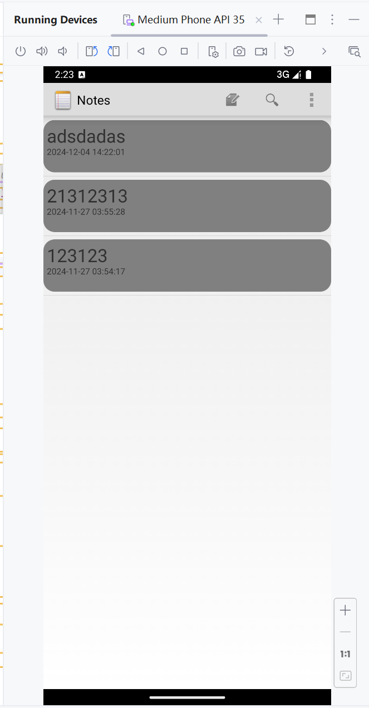


### 搜索功能
**功能描述**
在主界面中，点击搜索按钮，输入关键字即可检索笔记标题。支持模糊查询功能，无需输入完整标题即可找到相关笔记，适合大量笔记管理。

**实现原理**：
- 在 SQLite 中使用 `LIKE` 语句进行关键字匹配查询。
- 搜索结果会实时更新，并通过 Cursor 加载数据到 UI 层展示。

**代码实现**
1. #### 传递搜索查询参数
搜索查询的触发来自 onOptionsItemSelected 方法中的 "搜索" 选项。点击这个选项时，会弹出一个对话框，让用户输入搜索关键字。

1.首先为搜索功能创建一个新的视图note_search.xml

            <LinearLayout xmlns:android="http://schemas.android.com/apk/res/android"
                android:layout_width="match_parent"
                android:layout_height="match_parent"
                android:orientation="vertical">
                <SearchView
                    android:id="@+id/search_view"
                    android:layout_width="match_parent"
                    android:layout_height="wrap_content"
                    android:iconifiedByDefault="false"
                    android:queryHint="搜索">
                </SearchView>
                <ListView
                    android:id="@+id/list_view"
                    android:layout_width="match_parent"
                    android:layout_height="wrap_content"
                    >
                </ListView>
            </LinearLayout>

2. 在`list_options_menu.xml` 中添加新的item
   
        <item
            android:id="@+id/search"
            android:icon="@android:drawable/ic_search_category_default"
            android:title="Search"
            android:actionViewClass="android.widget.SearchView"
            android:showAsAction="always" />
   

3. 在`notelist.java` 中的onCreateOptionsMenu方法添加如下代码：
    
        MenuItem mSearch = menu.findItem(R.id.search);
        SearchView mSearchView = (SearchView)mSearch.getActionView();
        mSearchView.setQueryHint("搜索");
        mSearchView.setOnQueryTextListener(new SearchView.OnQueryTextListener() {
            @Override
            public boolean onQueryTextSubmit(String s) {
                return false;
            }
            @Override
            public boolean onQueryTextChange(String s) {
                Cursor cursor = managedQuery(
                        getIntent().getData(),            // Use the default content URI for the provider.
                        PROJECTION,                       // Return the note ID and title for each note.
                        NotePad.Notes.COLUMN_NAME_TITLE+" like ? or "+NotePad.Notes.COLUMN_NAME_NOTE+" like ?",                        // No where clause, return all records.
                        new String[]{"%"+s+"%","%"+s+"%"},                       // No where clause, therefore no where column values.
                        NotePad.Notes.DEFAULT_SORT_ORDER  // Use the default sort order.
                );
                String[] dataColumns = { NotePad.Notes.COLUMN_NAME_TITLE, NotePad.Notes.COLUMN_NAME_MODIFICATION_DATE,NotePad.Notes.COLUMN_NAME_NOTE} ;
                int[] viewIDs = { R.id.text1, R.id.text2,R.id.text3 };//加入修改时间
                SimpleCursorAdapter adapter
                        = new SimpleCursorAdapter(
                        NotesList.this,                             // The Context for the ListView
                        R.layout.notelist_item_2,          // Points to the XML for a list item
                        cursor,                           // The cursor to get items from
                        dataColumns,
                        viewIDs
                );
                setListAdapter(adapter);
                return false;
            }
        });

功能演示：
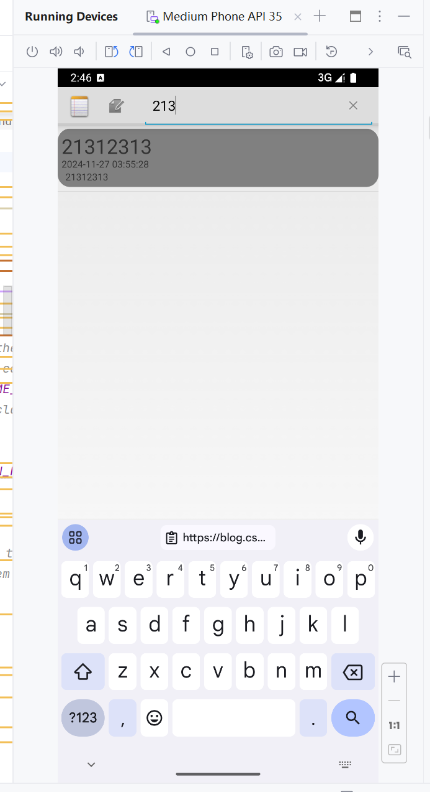

### 更换背景和字体颜色
#### 内容映射至笔记上
**功能描述**
进入笔记后能够查看更改的情况

**实现过程**

1.创建一个新的xml文件color.xml，并加入以下代码，在后续实现功能时通过点击对应按钮会弹出界面提示更改

        <LinearLayout xmlns:android="http://schemas.android.com/apk/res/android"
        android:layout_width="match_parent"
        android:layout_height="match_parent"
        android:orientation="horizontal">
        <Button
        android:id="@+id/white"
        android:layout_width="wrap_content"
        android:layout_height="match_parent"
        android:background="@color/white"
        android:layout_weight="1"
        android:onClick="onClick"/>
        <Button
        android:id="@+id/black"
        android:layout_width="wrap_content"
        android:layout_height="match_parent"
        android:background="@color/black"
        android:layout_weight="1"
        android:onClick="onClick"/>
        <Button
        android:id="@+id/orange"
        android:layout_width="wrap_content"
        android:layout_height="match_parent"
        android:background="@color/orange"
        android:layout_weight="1"
        android:onClick="onClick"/>
        <Button
        android:id="@+id/chocolate"
        android:layout_width="wrap_content"
        android:layout_height="match_parent"
        android:background="@color/chocolate"
        android:layout_weight="1"
        android:onClick="onClick"/>
        <Button
        android:id="@+id/aqua"
        android:layout_width="wrap_content"
        android:layout_height="match_parent"
        android:background="@color/aqua"
        android:layout_weight="1"
        android:onClick="onClick"/>
        <Button
        android:id="@+id/gray"
        android:layout_width="wrap_content"
        android:layout_height="match_parent"
        android:background="@color/gray"
        android:layout_weight="1"
        android:onClick="onClick"/>
        <Button
        android:id="@+id/pink"
        android:layout_width="wrap_content"
        android:layout_height="match_parent"
        android:background="@color/colorAccent"
        android:layout_weight="1"
        android:onClick="onClick"/>
        <Button
        android:id="@+id/green"
        android:layout_width="wrap_content"
        android:layout_height="match_parent"
        android:background="@color/green"
        android:layout_weight="1"
        android:onClick="onClick"/>
        </LinearLayout>

2.在values中添加color.xml，并加入以下代码

    <?xml version="1.0" encoding="utf-8"?>
    <resources>
        <color name="orange">#FFA500</color>
        <color name="chocolate">#D2691E</color>
        <color name="aqua">#00FFFF</color>
        <color name="gray">#808080</color>
        <color name="colorAccent">#FF0000</color>
        <color name="green">#008000</color>
        <color name="white">#FFFFFF</color>
        <color name="black">#000000</color>
    </resources>

3.在editor_options_menu.xml中添加新的item
    
    <item
        android:id="@+id/color"
        android:title="改变颜色">
        <menu>
            <item
                android:title="改变背景颜色"
                android:id="@+id/background_color">
            </item>
            <item android:id="@+id/text_color"
                android:title="改变字体颜色">
            </item>
        </menu>
    </item>

4.在NoteEditor.java中的onOptionsItemSelected做出修改，添加以下代码

    case R.id.background_color:
    isFlag=true;
    showColor();
    break;
    case R.id.text_color:
    isFlag=false;
    showColor();
    break;

5.同样的，在NoteEditor.java中添加以下代码实现showColor方法：这会弹出界面提供选择

    private void showColor(){
    Log.d("MenuOptions", "showColor method called");
    AlertDialog alertDialog=new AlertDialog.Builder(this).setTitle("请选择颜色").
    setView(R.layout.color_layout)
    .setPositiveButton("确定", new DialogInterface.OnClickListener() {
    @Override
    public void onClick(DialogInterface dialog, int which) {
    dialog.dismiss();
    }
    }).create();
    alertDialog.show();
    }

    public void onClick(View v) {
        switch (v.getId()){
            case R.id.white:
                if(isFlag){
                    mText.setBackgroundColor(Color.parseColor("#FFFFFF"));
                    SharedPreferences sharedPreferences=getSharedPreferences("myNotesApp",MODE_PRIVATE);
                    SharedPreferences.Editor editor=sharedPreferences.edit();
                    colorBack="#FFFFFF";
                    editor.putInt("backgroundColor",Color.parseColor(colorBack));
                    editor.apply();
                }else{
                    mText.setTextColor(Color.parseColor("#FFFFFF"));
                    SharedPreferences sharedPreferences=getSharedPreferences("myNotesApp",MODE_PRIVATE);
                    SharedPreferences.Editor editor=sharedPreferences.edit();
                    colorText="#FFFFFF";
                    editor.putInt("textColor",Color.parseColor(colorText));
                    editor.apply();
                }
                break;
            case R.id.black:
                if(isFlag){
                    mText.setBackgroundColor(Color.parseColor("#000000"));
                    SharedPreferences sharedPreferences=getSharedPreferences("myNotesApp",MODE_PRIVATE);
                    SharedPreferences.Editor editor=sharedPreferences.edit();
                    colorBack="#000000";
                    editor.putInt("backgroundColor",Color.parseColor(colorBack));
                    editor.apply();
                }else{
                    mText.setTextColor(Color.parseColor("#000000"));
                    SharedPreferences sharedPreferences=getSharedPreferences("myNotesApp",MODE_PRIVATE);
                    SharedPreferences.Editor editor=sharedPreferences.edit();
                    colorText="#000000";
                    editor.putInt("textColor",Color.parseColor(colorText));
                    editor.apply();
                }
                break;
            case R.id.orange:
                if(isFlag){
                    mText.setBackgroundColor(Color.parseColor("#FF8C00"));
                    SharedPreferences sharedPreferences=getSharedPreferences("myNotesApp",MODE_PRIVATE);
                    SharedPreferences.Editor editor=sharedPreferences.edit();
                    colorBack="#FF8C00";
                    editor.putInt("backgroundColor",Color.parseColor(colorBack));
                    editor.apply();
                }else{
                    mText.setTextColor(Color.parseColor("#FF8C00"));
                    SharedPreferences sharedPreferences=getSharedPreferences("myNotesApp",MODE_PRIVATE);
                    SharedPreferences.Editor editor=sharedPreferences.edit();
                    colorText="#FF8C00";
                    editor.putInt("textColor",Color.parseColor(colorText));
                    editor.apply();
                }
                break;
            case R.id.chocolate:
                if(isFlag){
                    mText.setBackgroundColor(Color.parseColor("#D2691E"));
                    SharedPreferences sharedPreferences=getSharedPreferences("myNotesApp",MODE_PRIVATE);
                    SharedPreferences.Editor editor=sharedPreferences.edit();
                    colorBack="#D2691E";
                    editor.putInt("backgroundColor",Color.parseColor(colorBack));
                    editor.apply();
                }else{
                    mText.setTextColor(Color.parseColor("#D2691E"));
                    SharedPreferences sharedPreferences=getSharedPreferences("myNotesApp",MODE_PRIVATE);
                    SharedPreferences.Editor editor=sharedPreferences.edit();
                    colorText="#D2691E";
                    editor.putInt("textColor",Color.parseColor(colorText));
                    editor.apply();
                }
                break;
            case R.id.aqua:
                if(isFlag){
                    mText.setBackgroundColor(Color.parseColor("#00FFFF"));
                    SharedPreferences sharedPreferences=getSharedPreferences("myNotesApp",MODE_PRIVATE);
                    SharedPreferences.Editor editor=sharedPreferences.edit();
                    colorBack="#00FFFF";
                    editor.putInt("backgroundColor",Color.parseColor(colorBack));
                    editor.apply();
                }else{
                    mText.setTextColor(Color.parseColor("#00FFFF"));
                    SharedPreferences sharedPreferences=getSharedPreferences("myNotesApp",MODE_PRIVATE);
                    SharedPreferences.Editor editor=sharedPreferences.edit();
                    colorText="#00FFFF";
                    editor.putInt("textColor",Color.parseColor(colorText));
                    editor.apply();
                }
                break;
            case R.id.gray:
                if(isFlag){
                    mText.setBackgroundColor(Color.parseColor("#696969"));
                    SharedPreferences sharedPreferences=getSharedPreferences("myNotesApp",MODE_PRIVATE);
                    SharedPreferences.Editor editor=sharedPreferences.edit();
                    colorBack="#696969";
                    editor.putInt("backgroundColor",Color.parseColor(colorBack));
                    editor.apply();
                }else{
                    mText.setTextColor(Color.parseColor("#696969"));
                    SharedPreferences sharedPreferences=getSharedPreferences("myNotesApp",MODE_PRIVATE);
                    SharedPreferences.Editor editor=sharedPreferences.edit();
                    colorText="#696969";
                    editor.putInt("textColor",Color.parseColor(colorText));
                    editor.apply();
                }
                break;
            case R.id.pink:
                if(isFlag){
                    mText.setBackgroundColor(Color.parseColor("#D81B60"));
                    SharedPreferences sharedPreferences=getSharedPreferences("myNotesApp",MODE_PRIVATE);
                    SharedPreferences.Editor editor=sharedPreferences.edit();
                    colorBack="#D81B60";
                    editor.putInt("backgroundColor",Color.parseColor(colorBack));
                    editor.apply();
                }else{
                    mText.setTextColor(Color.parseColor("#D81B60"));
                    SharedPreferences sharedPreferences=getSharedPreferences("myNotesApp",MODE_PRIVATE);
                    SharedPreferences.Editor editor=sharedPreferences.edit();
                    colorText="#D81B60";
                    editor.putInt("textColor",Color.parseColor(colorText));
                    editor.apply();
                }
                break;
            case R.id.green:
                if(isFlag){
                    mText.setBackgroundColor(Color.parseColor("#00FF7F"));
                    SharedPreferences sharedPreferences=getSharedPreferences("myNotesApp",MODE_PRIVATE);
                    SharedPreferences.Editor editor=sharedPreferences.edit();
                    colorBack="#00FF7F";
                    editor.putInt("backgroundColor",Color.parseColor(colorBack));
                    editor.apply();
                }else{
                    mText.setTextColor(Color.parseColor("#00FF7F"));
                    SharedPreferences sharedPreferences=getSharedPreferences("myNotesApp",MODE_PRIVATE);
                    SharedPreferences.Editor editor=sharedPreferences.edit();
                    colorText="#00FF7F";
                    editor.putInt("textColor",Color.parseColor(colorText));
                    editor.apply();
                }
                break;
        }


    }


6.实验运行后发现这样不会保存修改，进行修改，在NoteEditor的OnCreate方法中添加如下代码：

    SharedPreferences sharedPreferences=getSharedPreferences("myNotesApp",MODE_PRIVATE);
    int backColor=sharedPreferences.getInt("backgroundColor",Color.WHITE);
    int textColor=sharedPreferences.getInt("textColor",Color.BLACK);
    mText.setBackgroundColor(backColor);
    mText.setTextColor(textColor);
这样子所做的修改就能保存下来了
功能演示：
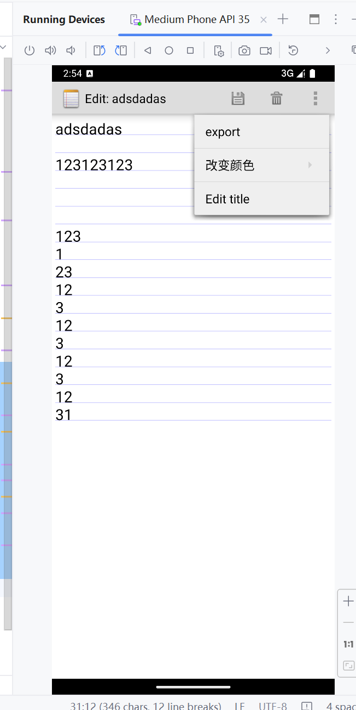

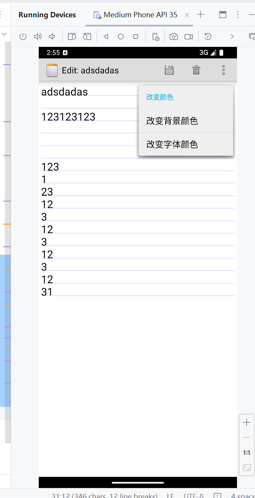

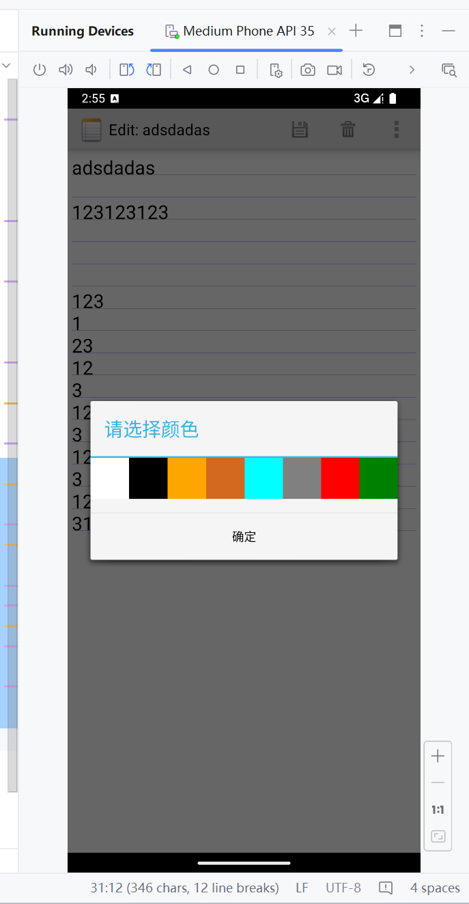

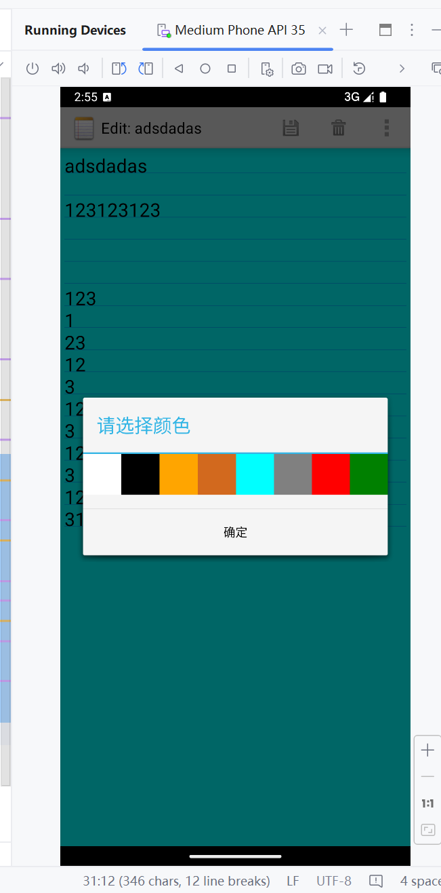

重新进入一个新的笔记，会发现背景更改保存了下来
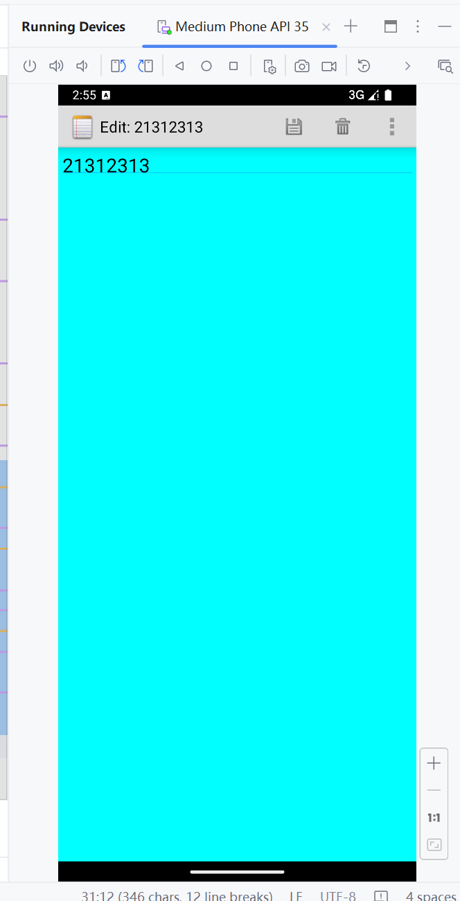


### 文件导出

**功能描述**
在笔记菜单中选择export功能，笔记将会被以.txt文件的形式导出至storage/download下

**代码实现**
导出功能的组件同样被放在笔记的菜单中：
```
<item android:id="@+id/menu_export"
          android:icon="@drawable/ic_menu_edit"
          android:title="export"/>
```


1. 文件导出功能的触发：
   导出功能通过 menu_export 选项在菜单中触发
``` java
case R.id.menu_export:
    export();
    break;
```
当用户选择“导出”菜单项时，调用了 export() 方法。

2. export() 方法：
   export() 方法展示一个对话框，提示用户输入文件名：
``` java
private void export() {
    final EditText input = new EditText(this);
    input.setHint("请输入文件名");

    AlertDialog dialog = new AlertDialog.Builder(this)
            .setTitle("导出笔记")
            .setView(input)
            .setPositiveButton("确定", new DialogInterface.OnClickListener() {
                @Override
                public void onClick(DialogInterface dialogInterface, int which) {
                    String fileName = input.getText().toString().trim();
                    if (fileName.isEmpty()) {
                        Toast.makeText(NoteEditor.this, "文件名不能为空", Toast.LENGTH_SHORT).show();
                    } else {
                        // 启动文件选择器
                        openFilePicker(fileName);
                    }
                }
            })
            .setNegativeButton("取消", null)
            .create();
    dialog.show();
    dialog.getButton(AlertDialog.BUTTON_POSITIVE).setTextColor(Color.BLACK);
}
```
首先，EditText 组件让用户输入文件名。
如果用户点击“确定”，系统会检查文件名是否为空。如果为空，提示错误信息；否则，调用 openFilePicker(fileName) 方法来启动文件选择器，让用户选择保存文件的路径。

3. 打开文件选择器：openFilePicker(fileName) 方法：
   该方法使用 Intent.ACTION_CREATE_DOCUMENT 启动系统的文件选择器，并允许用户创建新的文本文件：
``` java
private void openFilePicker(String fileName) {
    Intent intent = new Intent(Intent.ACTION_CREATE_DOCUMENT);
    intent.addCategory(Intent.CATEGORY_OPENABLE);
    intent.setType("text/plain");
    intent.putExtra(Intent.EXTRA_TITLE, fileName + ".txt"); // 用户输入的文件名
    startActivityForResult(intent, REQUEST_CODE_EXPORT);
}
```
这个 Intent 用于创建一个新的文档，文件类型为纯文本 (text/plain)。
文件名来自用户输入，后缀为 .txt。
startActivityForResult() 启动文件选择器，并等待用户选择位置后返回结果。

4. 处理文件选择结果：
   当用户在文件选择器中选择了保存位置，系统将调用 onActivityResult() 方法
``` java
@Override
protected void onActivityResult(int requestCode, int resultCode, Intent data) {
    super.onActivityResult(requestCode, resultCode, data);

    if (requestCode == REQUEST_CODE_EXPORT && resultCode == RESULT_OK) {
        Uri fileUri = data.getData();

        if (fileUri != null) {
            saveNoteToFile(fileUri);
        } else {
            Toast.makeText(this, "文件创建失败", Toast.LENGTH_SHORT).show();
        }
    }
}
```
首先检查 requestCode 是否为导出文件的请求码 (REQUEST_CODE_EXPORT)。
如果结果是 RESULT_OK，则从 data 中获取保存的文件 Uri，然后调用 saveNoteToFile(fileUri) 方法将笔记内容写入文件。

5. 保存笔记内容到文件：saveNoteToFile() 方法：
``` java
private void saveNoteToFile(Uri fileUri) {
    try {
        // 获取笔记内容
        String noteContent = mText.getText().toString();

        // 打开输出流并写入数据
        try (OutputStream outputStream = getContentResolver().openOutputStream(fileUri)) {
            if (outputStream != null) {
                outputStream.write(noteContent.getBytes());
                outputStream.flush();
                Toast.makeText(this, "笔记导出成功", Toast.LENGTH_SHORT).show();
            } else {
                Toast.makeText(this, "无法打开文件", Toast.LENGTH_SHORT).show();
            }
        }
    } catch (Exception e) {
        e.printStackTrace();
        Toast.makeText(this, "导出失败：" + e.getMessage(), Toast.LENGTH_SHORT).show();
    }
}
```
该方法通过 fileUri 打开一个输出流。
然后，它从 EditText 获取当前的笔记内容 (noteContent)，并将其转换为字节数组写入输出流中。
成功写入后，显示“笔记导出成功”的提示，否则提示相应的错误信息。
导出功能就做好了

**功能截图**
右上角export按钮触发导出功能
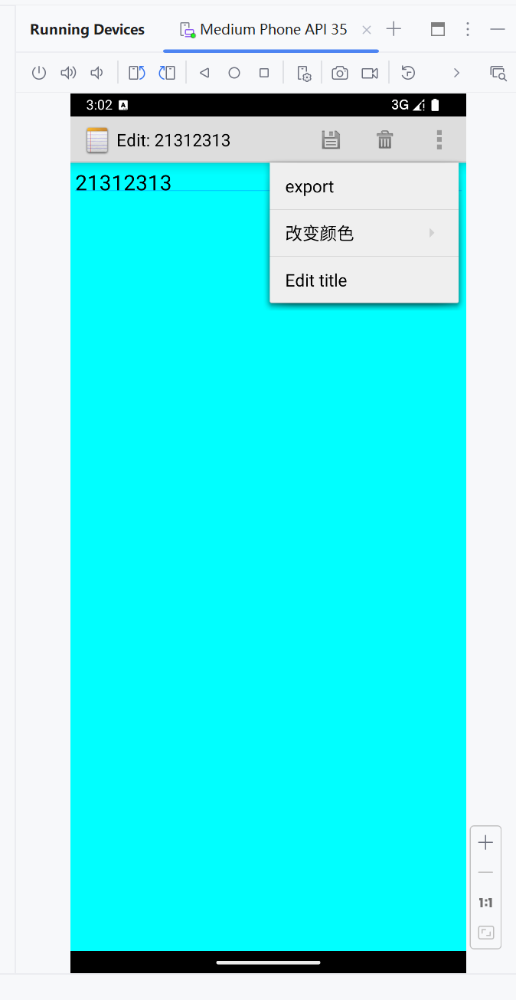


点击后进入弹出
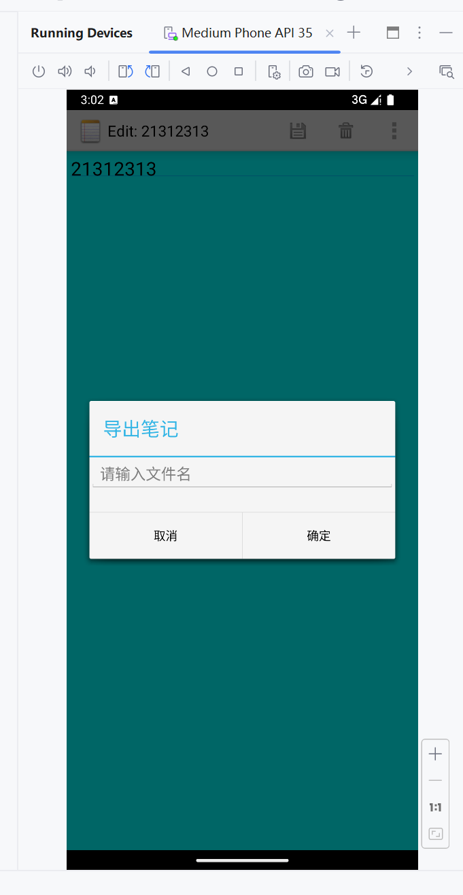

输入要导出的文件名
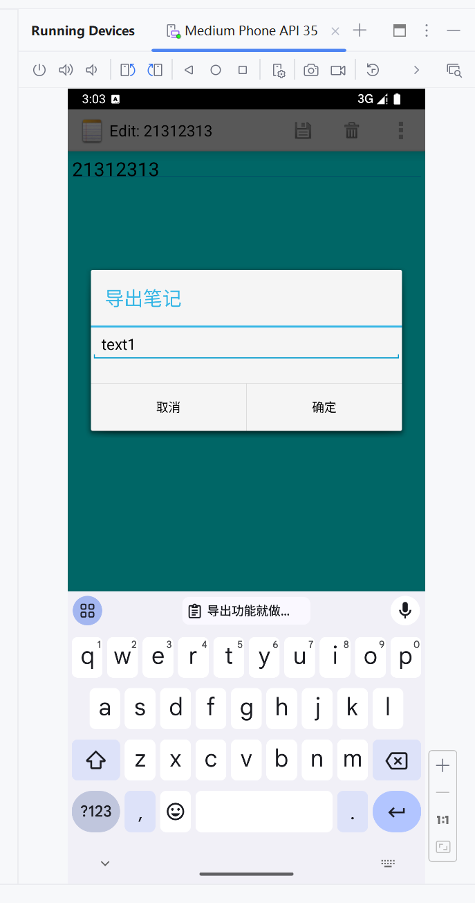

进入Files文件，这里可以看到我们的导出文件在下方
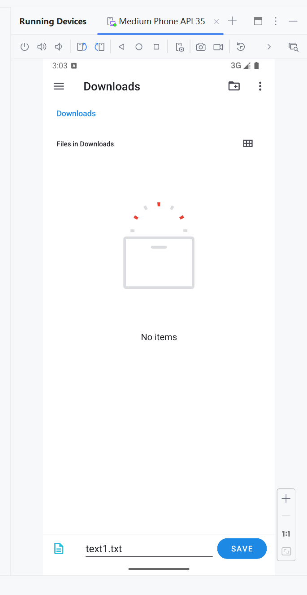

保存后进入Files文件可以看到我们刚刚保存的文件
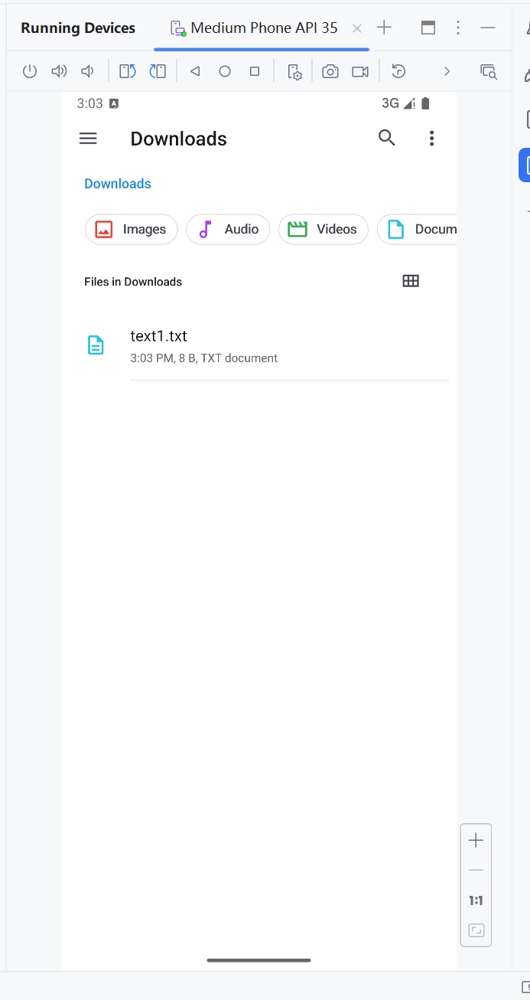

进入后可以看到我们保存的内容
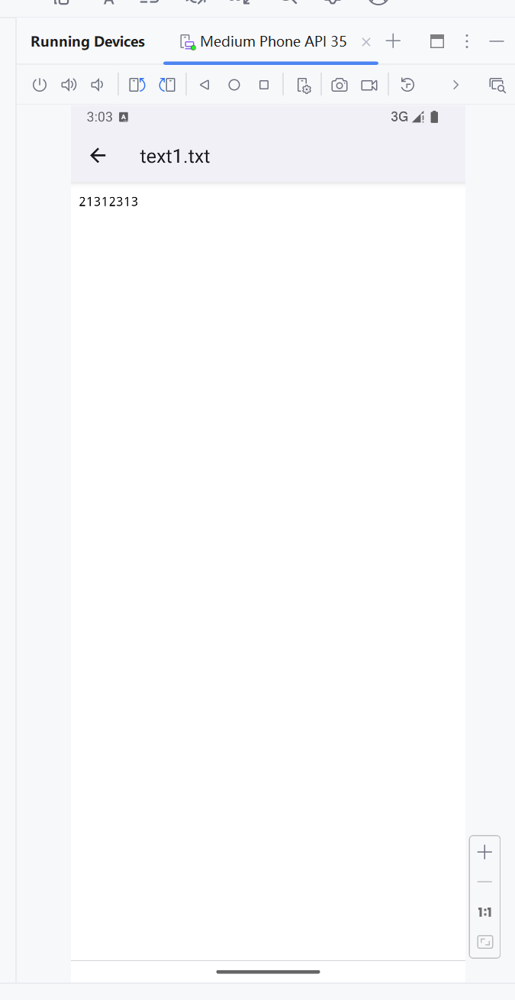


